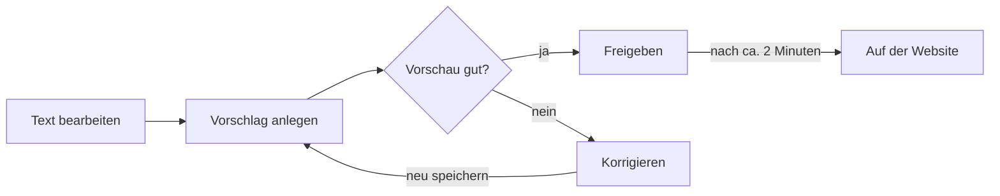

# Anleitung: Website-Inhalte bearbeiten

Für den Vorstand des Fördervereins Sonnenblume e.V. · Stand: Oktober 2026

## So funktioniert die Website

Sie ändern einen Text im Browser, prüfen eine Vorschau und geben die Änderung frei. Etwa zwei Minuten später ist sie auf der Website. Programmieren müssen Sie dafür nicht.

Alle Texte der Website liegen als einfache Textdateien bei **GitHub**, einem Online-Dienst zum Verwalten von Dateien. Man kann sich GitHub wie einen geteilten Ordner vorstellen, der sich jede Änderung merkt. Jede Seite der Website ist eine eigene Datei, zum Beispiel gehört die Datei `kontakt.md` zur Seite *Kontakt*.

Sobald eine Änderung freigegeben ist, baut GitHub die Website automatisch neu und veröffentlicht sie. Sie müssen nichts hochladen und keinen Server bedienen.

Drei Dinge geben Sicherheit:

- **Nichts geht verloren.** GitHub speichert jede frühere Fassung. Jede Änderung lässt sich rückgängig machen.
- **Erst prüfen, dann veröffentlichen.** Zu jeder Änderung entsteht eine Vorschau-Seite, die nur Sie sehen, solange Sie den Link nicht weitergeben.
- **Die Oberfläche von GitHub ist auf Englisch.** Diese Anleitung nennt die englischen Knopf-Beschriftungen genau so, wie sie auf dem Bildschirm stehen.

## Einmalige Vorbereitung

Sie brauchen ein kostenloses GitHub-Konto und eine Einladung von dem Vorstandsmitglied, das die Website verwaltet. Das dauert etwa zehn Minuten und ist nur einmal nötig.

1. Gehen Sie auf [github.com/signup](https://github.com/signup) und legen Sie ein Konto an. Sie brauchen dazu nur eine E-Mail-Adresse, einen Benutzernamen und ein Passwort. Ein kostenloses Konto reicht.
2. Schicken Sie diesem Vorstandsmitglied Ihren **Benutzernamen** (nicht das Passwort).
3. Sie werden eingeladen. Sie bekommen eine E-Mail von GitHub mit dem Betreff „… invited you to collaborate“.
4. Klicken Sie in der E-Mail auf **View invitation** und dann auf **Accept invitation**.

Danach können Sie die Website bearbeiten. Melden Sie sich zum Arbeiten immer unter [github.com](https://github.com) an. Die Dateien der Website finden Sie dann unter [github.com/jastBytes/sonnenblume-ev-website](https://github.com/jastBytes/sonnenblume-ev-website).

**Für das Vorstandsmitglied, das die Website verwaltet:** Einladen geht im Projekt über **Settings** → **Collaborators** → **Add people**, dort den Benutzernamen eintragen.

## Welche Datei gehört zu welcher Seite

Jede Seite der Website hat ihre eigene Datei. Ein Klick auf den Link in der rechten Spalte öffnet die Datei direkt zum Bearbeiten (vorher bei GitHub anmelden).

| Seite auf der Website | Was dort steht | Datei zum Bearbeiten |
| --- | --- | --- |
| Startseite | Begrüßungstext | [\_index.md](https://github.com/jastBytes/sonnenblume-ev-website/edit/main/content/_index.md) |
| Über uns | Verein, Vorstand, Wahldatum | [ueber-uns.md](https://github.com/jastBytes/sonnenblume-ev-website/edit/main/content/ueber-uns.md) |
| Aktivitäten | Rückblick und geplante Termine | [aktivitaeten.md](https://github.com/jastBytes/sonnenblume-ev-website/edit/main/content/aktivitaeten.md) |
| Mitmachen | Mitgliedschaft, Spenden, Formulare | [mitmachen.md](https://github.com/jastBytes/sonnenblume-ev-website/edit/main/content/mitmachen.md) |
| Kontakt | Kontaktwege | [kontakt.md](https://github.com/jastBytes/sonnenblume-ev-website/edit/main/content/kontakt.md) |
| Impressum | Pflichtangaben, Vorstand | [impressum.md](https://github.com/jastBytes/sonnenblume-ev-website/edit/main/content/impressum.md) |
| Datenschutz | Datenschutzerklärung | [datenschutz.md](https://github.com/jastBytes/sonnenblume-ev-website/edit/main/content/datenschutz.md) |
| Mehrere Seiten | E-Mail, Anschrift, Bankverbindung, Kindergarten-Adresse | [config.toml](https://github.com/jastBytes/sonnenblume-ev-website/edit/main/config.toml), Abschnitt `[params.verein]` |
| Downloads | Beitrittserklärung und SEPA-Mandat als PDF | Ordner [static/docs](https://github.com/jastBytes/sonnenblume-ev-website/tree/main/static/docs) |

Die Endung `.md` steht für „Markdown“: normaler Text mit ein paar Zeichen für Überschriften, Fettdruck und Listen. Welche Zeichen das sind, steht im Spickzettel weiter unten.

## Schritt für Schritt: einen Text ändern

Jede Änderung läuft in drei Schritten: bearbeiten, in der Vorschau prüfen, freigeben. Rechnen Sie für eine kleine Änderung mit etwa zehn Minuten, davon fünf Minuten Warten.



Solange die Vorschau nicht stimmt, korrigieren Sie im selben Vorschlag. Die Website bleibt dabei unverändert.

### 1. Bearbeiten

1. Melden Sie sich bei [github.com](https://github.com) an.
2. Öffnen Sie die passende Datei über die Tabelle oben. Sie sehen den Text der Seite in einem Eingabefeld.
   - Alternativ: Datei in der Dateiliste anklicken, dann oben rechts auf das **Stift-Symbol** („Edit this file“).
3. Ändern Sie den Text direkt im Feld, wie in einem Textprogramm.
4. Klicken Sie oben rechts auf den grünen Knopf **Commit changes…**. („Commit“ heißt hier so viel wie „Speichern“.)
5. Es öffnet sich ein Fenster:
   - Bei **Commit message** steht ein Vorschlag wie „Update kontakt.md“. Schreiben Sie besser kurz hinein, was Sie geändert haben, z. B. „Termin Weihnachtsmarkt ergänzt“.
   - Wählen Sie unten **Create a new branch for this commit and start a pull request**. Damit wird die Änderung noch nicht veröffentlicht, sondern erst zur Prüfung vorgelegt. Wählen Sie diese Option immer, auch für einen kleinen Tippfehler.
   - Klicken Sie auf **Propose changes**.
6. Auf der nächsten Seite klicken Sie auf den grünen Knopf **Create pull request**. („Pull Request“ ist der Fachbegriff für „Änderungsvorschlag“.)

### 2. In der Vorschau prüfen

1. Sie landen auf der Seite Ihres Änderungsvorschlags. Warten Sie ein bis zwei Minuten.
2. Dann erscheint dort ein Kommentar mit **🔍 Preview:** und einem Link. Klicken Sie darauf.
3. Die Vorschau zeigt die komplette Website mit Ihrer Änderung. Prüfen Sie die geänderte Seite.
4. Stimmt etwas nicht? Klicken Sie im Änderungsvorschlag oben auf den Reiter **Files changed**, dann rechts neben dem Dateinamen auf **…** und **Edit file**. Korrigieren Sie den Text und klicken Sie wieder auf **Commit changes…**. Die Option **Commit directly to the … branch** ist dabei schon richtig ausgewählt. Nach ein bis zwei Minuten zeigt derselbe Vorschau-Link den neuen Stand (Seite neu laden).

### 3. Freigeben

1. Scrollen Sie auf der Seite des Änderungsvorschlags nach unten zum grünen Knopf **Merge pull request** und klicken Sie darauf. („Merge“ bedeutet „übernehmen“.)
2. Bestätigen Sie mit **Confirm merge**.
3. Nach etwa zwei Minuten ist die Änderung auf der Website. Falls Sie noch den alten Stand sehen: Seite neu laden.
4. Den Hinweis **Delete branch** können Sie anklicken, um aufzuräumen. Nötig ist das nicht.

Sind Sie unsicher, ob eine Änderung so passt? Lassen Sie den Änderungsvorschlag einfach offen und schicken Sie den Vorschau-Link an ein Vorstandsmitglied mit mehr Erfahrung. Solange niemand auf **Merge pull request** klickt, ändert sich an der Website nichts.

## Spickzettel: Text formatieren

Mit ein paar Zeichen legen Sie fest, wie der Text auf der Website aussieht. Mehr als diese Zeichen brauchen Sie nicht.

| Das schreiben Sie in die Datei | So erscheint es auf der Website |
| --- | --- |
| `## Geplante Aktivitäten` | Eine Überschrift (zwei Rautenzeichen, dann ein Leerzeichen) |
| `### Wie können Sie uns erreichen?` | Eine kleinere Zwischenüberschrift |
| `**Mitgliedsbeitrag**` | **Mitgliedsbeitrag** (fett) |
| `*Kontakt*` | *Kontakt* (kursiv) |
| `- St.-Martins-Umzug` | Ein Listenpunkt (Bindestrich, dann ein Leerzeichen) |
| `␣␣- Unterpunkt` (␣ = Leerzeichen) | Ein eingerückter Unterpunkt (zwei Leerzeichen davor) |
| `[Kontakt](../kontakt)` | Ein Link mit dem Text „Kontakt“, der zur Kontaktseite führt |
| `[Verein](https://beispiel.de)` | Ein Link auf eine andere Website |
| eine leere Zeile | Ein neuer Absatz |
| `\` am Zeilenende | Ein Zeilenumbruch innerhalb eines Absatzes |

Ein einfacher Zeilenwechsel ohne Leerzeile erscheint auf der Website **nicht** als neue Zeile, der Text läuft dann weiter. Für eine neue Zeile also entweder eine Leerzeile lassen (neuer Absatz) oder `\` ans Zeilenende setzen.

Im Impressum enden manche Zeilen mit zwei unsichtbaren Leerzeichen. Die bewirken ebenfalls einen Zeilenumbruch. Lassen Sie sie stehen, wenn Sie dort etwas ändern.

## Häufige Aufgaben

Die meisten Änderungen betreffen Termine, den Vorstand oder die Kontaktdaten. Jede läuft nach den drei Schritten oben: bearbeiten, Vorschau prüfen, freigeben.

### Termine und Aktivitäten aktualisieren

Datei: `aktivitaeten.md`. Unter **Geplante Aktivitäten** steht pro Zeile ein Termin, z. B. `- Stand auf dem Oberemser Weihnachtsmarkt – 06.12.2026`. Fügen Sie neue Zeilen nach demselben Muster ein oder löschen Sie erledigte.

Zu Beginn eines neuen Vereinsjahres (1. August) wandert die Liste der geplanten Aktivitäten in den Rückblick. Passen Sie dabei auch die Jahreszahlen in den Überschriften an, z. B. `## Aktivitäten 2026/2027`.

### Nach einer Vorstandswahl

Der Vorstand steht an mehreren Stellen. Haken Sie die Punkte nach der Wahl ab:

- [ ] `ueber-uns.md`: Namen, Ämter und das Datum der Wahl
- [ ] `impressum.md`: Liste unter **Vertreten durch**
- [ ] Nur wenn der 1. Vorsitz wechselt, außerdem:
  - [ ] `impressum.md`: Name und Anschrift unter **Verantwortlich für den Inhalt** und die Zeile `c/o …` unter **Anschrift**
  - [ ] `datenschutz.md`: Zeile `c/o …` unter **1. Verantwortlicher**
  - [ ] `config.toml`: Zeile `anschrift = "c/o …"` (sie erscheint auf *Kontakt* und *Mitmachen*)
  - [ ] SEPA-Mandat (PDF): Anschrift in der Word-Vorlage ändern und das PDF neu hochladen (siehe unten)
  - [ ] Die Anschrift zur Gläubiger-ID bei der Deutschen Bundesbank aktualisieren lassen (Aufgabe des Kassenwarts)

### E-Mail, Anschrift oder Bankverbindung ändern

Diese Angaben stehen zentral in der Datei `config.toml` im Abschnitt `[params.verein]` und erscheinen von dort automatisch auf *Kontakt* und *Mitmachen*. Eine Zeile sieht so aus:

```
iban = "DE24 5019 0000 6000 5794 57"
```

Ändern Sie nur den Text **zwischen den Anführungszeichen**. Das Wort davor und die Anführungszeichen selbst müssen bleiben.

Die E-Mail-Adresse steht zusätzlich direkt im Text von `impressum.md` und `datenschutz.md`. Ändern Sie sie dort ebenfalls.

### Ein PDF austauschen

Die Formulare liegen im Ordner `static/docs`. So ersetzen Sie eines:

1. Geben Sie der neuen Datei auf Ihrem Computer **genau denselben Namen** wie die alte: `Beitrittserklaerung.pdf` oder `SEPA-Lastschriftmandat.pdf`. Groß- und Kleinschreibung zählen. Nur so funktionieren die Links auf der Website weiter.
2. Öffnen Sie den Ordner [static/docs](https://github.com/jastBytes/sonnenblume-ev-website/tree/main/static/docs) und klicken Sie oben rechts auf **Add file** → **Upload files**.
3. Ziehen Sie die Datei in das Fenster. Die alte Datei wird dabei ersetzt.
4. Unten wieder **Create a new branch for this commit and start a pull request** wählen, dann **Propose changes** und weiter wie in Schritt 2 und 3 oben.

Achten Sie auf die Dateigröße: Ein Formular sollte unter 1 MB liegen. In InDesign oder Word beim Export als PDF die Einstellung für die kleinste Dateigröße wählen.

## Was Sie nicht anfassen sollten und was bei Problemen hilft

Solange Sie nur Text in den Dateien aus der Tabelle oben ändern, kann wenig schiefgehen. Drei Stellen sehen aus wie Text, steuern aber die Technik.

### Bitte unverändert lassen

- **Der Kopfbereich jeder Datei** zwischen den beiden Linien aus drei Bindestrichen `---` ganz oben. Er legt z. B. fest, wo die Seite im Menü steht. Nur `title:` (Seitentitel) und `description:` (Untertitel) dürfen Sie anpassen.
- **Platzhalter in doppelten geschweiften Klammern** wie ``. An dieser Stelle setzt die Website automatisch den Wert aus `config.toml` ein, hier die IBAN. Um die IBAN zu ändern, ändern Sie sie in `config.toml`, nicht den Platzhalter.
- **Alle anderen Dateien und Ordner** außer `content`, `static/docs` und dem Abschnitt `[params.verein]` in `config.toml`. Ordner wie `layouts`, `themes` oder `.github` gehören zur Technik.

### Wenn etwas schiefgeht

| Was Sie sehen | Was es bedeutet | Was Sie tun |
| --- | --- | --- |
| Nach fünf Minuten kein Kommentar mit Vorschau-Link, oder ein rotes ✖ bzw. „Some checks were not successful“ | Die Website ließ sich mit der Änderung nicht bauen, meist wegen eines Tippfehlers im Kopfbereich oder fehlender Anführungszeichen in `config.toml` | Nicht freigeben. Den Link zum Änderungsvorschlag an ein Vorstandsmitglied mit mehr Erfahrung schicken. Die Website bleibt so lange unverändert. |
| Die Vorschau sieht anders aus als erwartet | Die Änderung ist noch nicht öffentlich | Im Änderungsvorschlag korrigieren (Schritt 2, Punkt 4) oder den Vorschlag mit **Close pull request** verwerfen |
| Nach der Freigabe ist auf der Website etwas falsch | Die Änderung ist öffentlich, lässt sich aber zurücknehmen | Oben auf **Pull requests**, dann **Closed**, den eigenen Vorschlag öffnen und unten auf **Revert** klicken. Das erzeugt einen neuen Vorschlag, der die Änderung rückgängig macht. Diesen wie gewohnt freigeben. |
| Versehentlich **Commit directly to the main branch** gewählt | Die Änderung ging ohne Vorschau direkt online | Website prüfen. Ist alles in Ordnung, ist nichts zu tun, sonst mit einer neuen Änderung korrigieren. |
| Die Änderung ist freigegeben, aber auf der Website nicht zu sehen | Die Veröffentlichung dauert noch, oder der Browser zeigt eine alte Fassung | Zwei Minuten warten und die Seite neu laden |

Bei allen anderen Fragen wenden Sie sich an ein Vorstandsmitglied mit mehr Erfahrung. Da GitHub jede frühere Fassung speichert, lässt sich jeder Fehler beheben.
